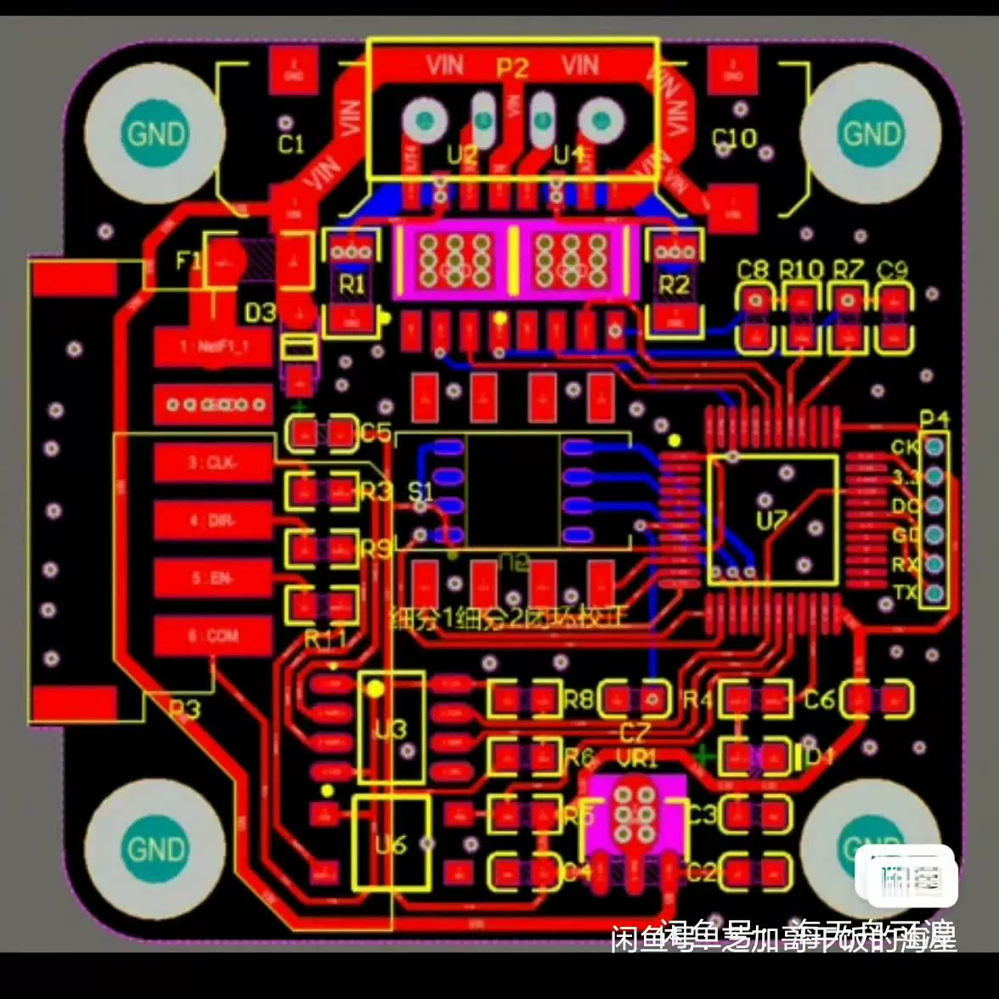
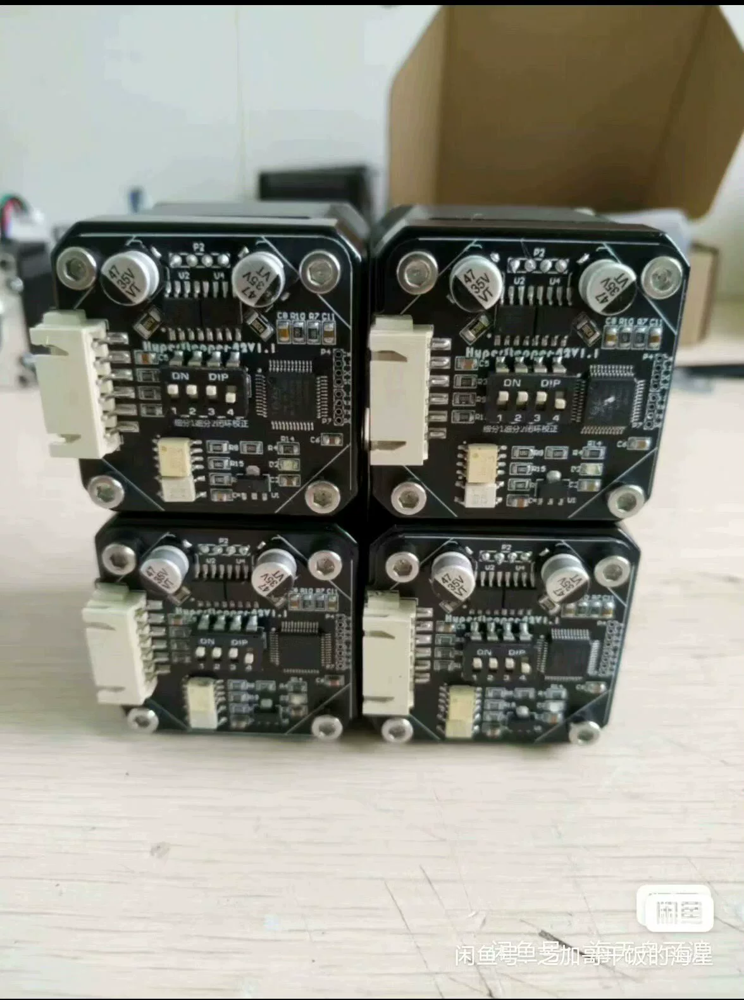
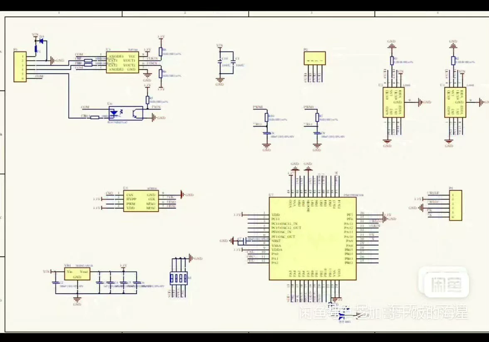

# 【Instant Delivery】Complete Solution for Closed-Loop Servo Stepper Motor (Magnetic Coder) with Schematic Diagram and PC

## Body

【Instant Release】Complete Solution for Closed-Loop Servo Stepper Motor (Magnetic Coder) with Schematic Diagram, PC, and PCB, Source Code
Operating Voltage: 12-30V
Main Control: HK32F030C8T6

## Images

## Payment

Here is a pay link on Stripe ( https://buy.stripe.com/3cs8yP7sY87d0vu9AB ). Please contact me lonlonago@foxmail.com after funding $89, and I will send you a complete data files , thank you!

